Lab 05: Build a fitness app with GitHub Copilot agent mode

Objective:

In this lab, you will:

- Setup and initialize preconfigured development environment for
  building a full stack application using **GitHub Codespaces** (Create
  a repository from a template 🡪 Create a codespace🡪Pre-configured
  workspace)

- Use Copilot agent mode in Visual Studio Code to create a branch and
  publish it.

- Setup application directory structure, frontend & backend directories,
  and MongoDB.

- Setup MongoDB, modify App Files, and validate test data.

You will be using a modern web application stack:

- Frontend: React.js

- Backend: Python with Django REST Framework

- Database: MongoDB

- Development Environment: GitHub Codespaces

### Exercise \#1: Create **GitHub Copilot agent mode** development environment

1.  Sign in to your GitHub account.

2.  Browse to the following link:
    <https://github.com/skills/build-applications-w-copilot-agent-mode>

> In this lab you will create the repository using a public template
> “**skills-build-applications-w-copilot-agent-mode**”.
>
> 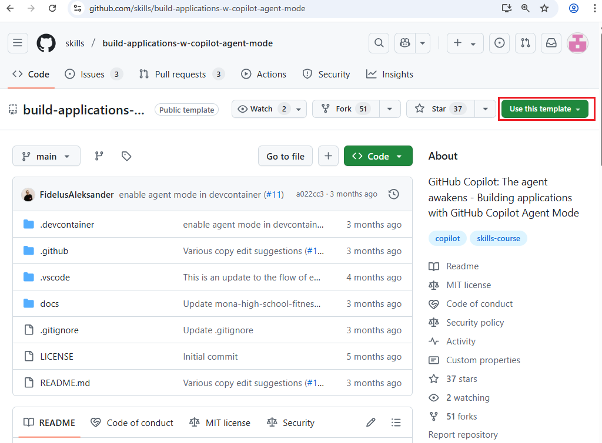

3.  Select **Create a new repository** under **Use this template** menu.

> 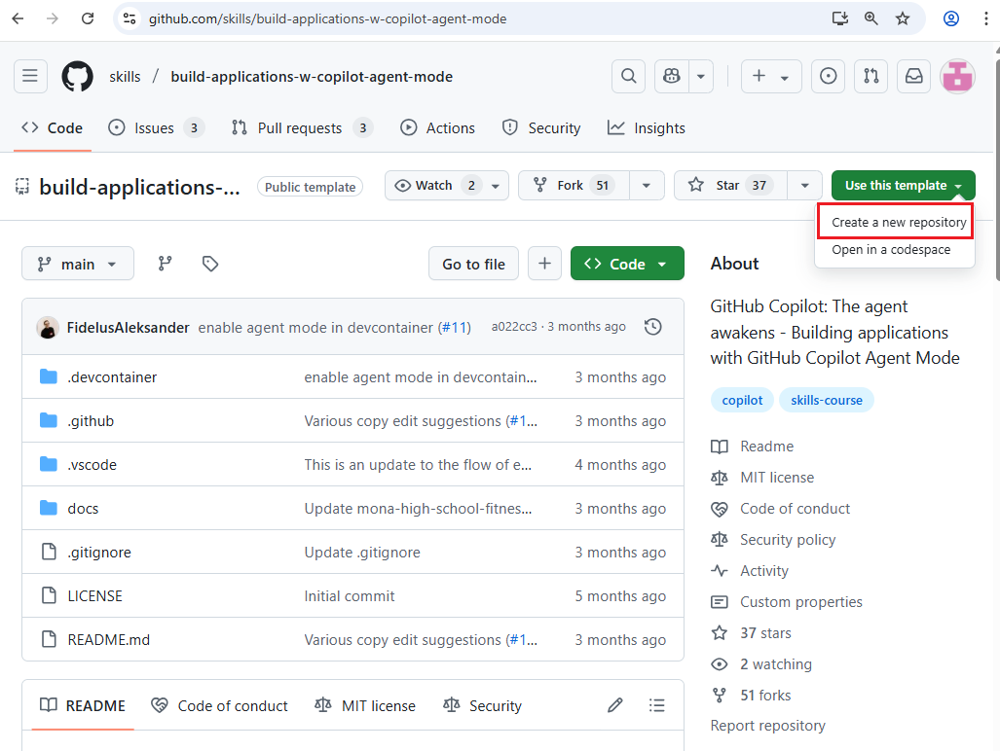

4.  Enter the following details and select **Create Repository**.

- Repository name: **skills-build-applications-w-copilot-agent-mode**

- Repository type: **Public**

> 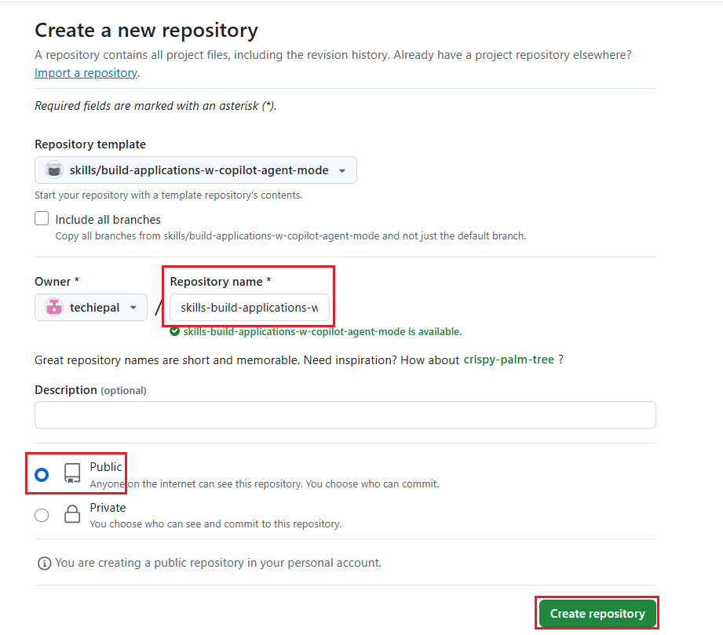

5.  Click the green-coloured **Code** button to proceed with creating
    workspace in the cloud.

> In the drop-down pane select **Codespaces** tab.

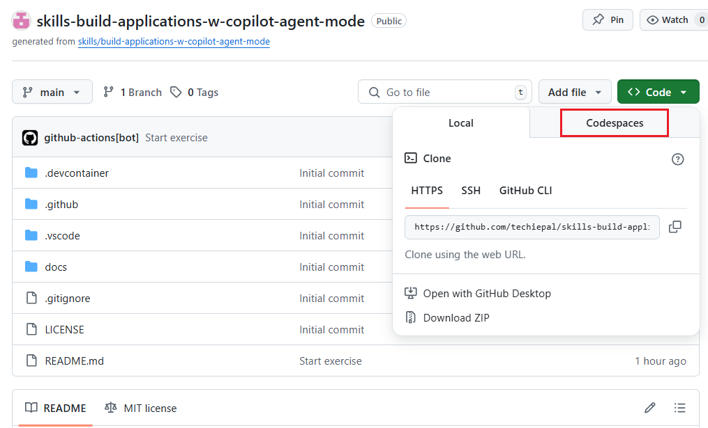

6.  Click **Create codespace on main** button.

> 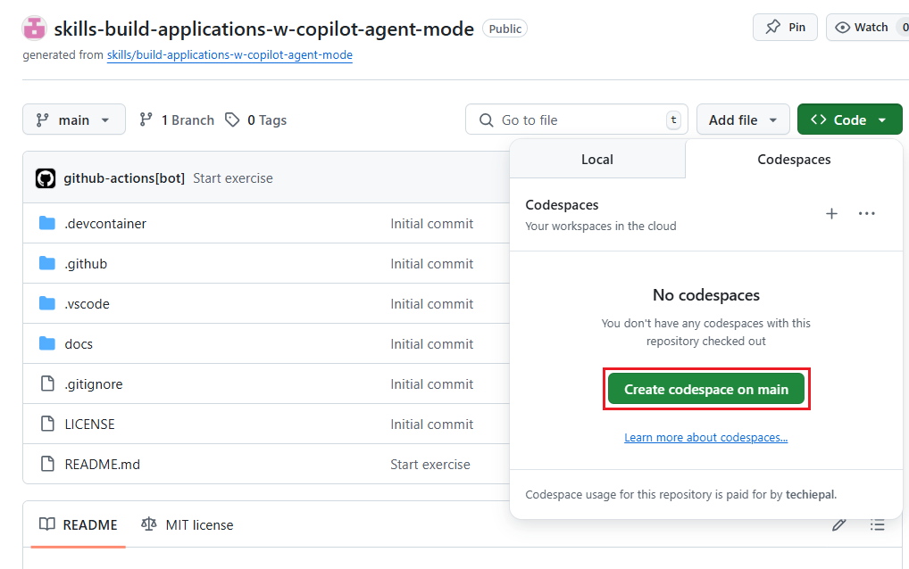

7.  Wait for some time (approximately 5 mins) for Visual Studio Code to
    load and complete creating the codespace.

> 
>
> 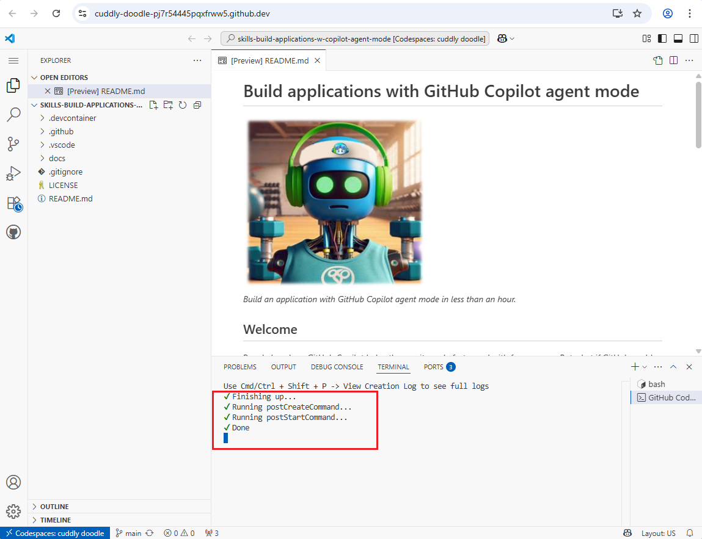
>
> Note: You may need to switch to VS Code insiders edition in the
> codespace since agent mode was released recently as a phased rollout
> to users.
>
> 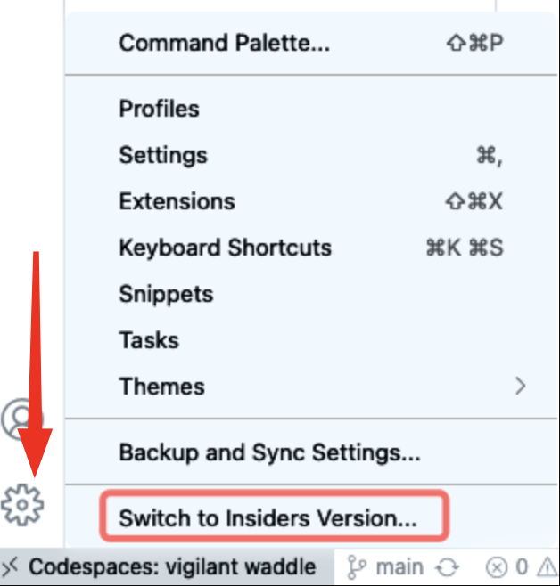

8.  Now spend some time to familiarize yourself with the project folder.

    - The left navigation bar is where you can access the file explorer,
      debugger, and search.

> 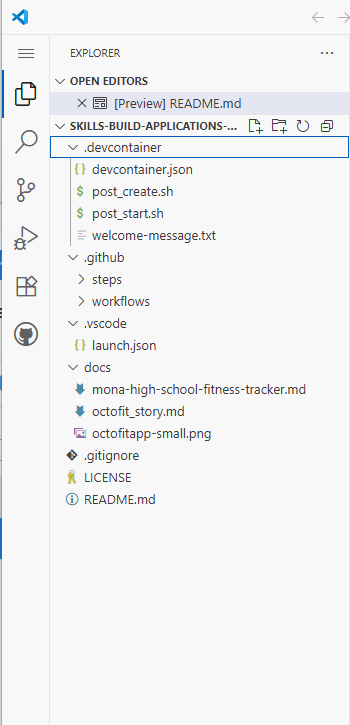

- The lower panel (Ctrl+J) shows the debugger output, allows running
  terminal commands, and allows configuring the web service ports.

> 
>
> 

- Docs folder contains another sample application repository that will
  give Copilot agent mode context to build your application.

9.  At the top of VS Code, locate and click the Copilot icon to open a
    Copilot Chat panel.

> 
>
> If this is your first, time using GitHub Copilot, you will have to
> accept the usage terms to continue.

- Click the **Accept** button to continue.

- If you are using Copilot Chat for the first time, you will also have
  to accept the usage terms to continue.

- Click the **Accept** button to continue.

### Exercise \#2: Create a branch and publish it using Copilot agent mode. 

Now that we are familiar with the app and we know it works, let's ask
copilot for help starting a branch so we can do some customizing.

1.  If not already there, return to VS Code.

2.  Open the GitHub Copilot Chat window if not already open.

> 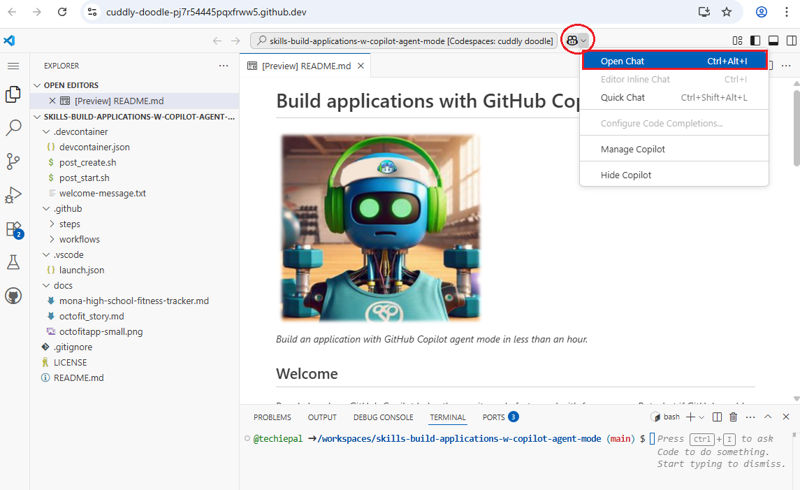

3.  Copy and paste the following prompt in the GitHub Copilot Chat and
    select the **Agent** instead of **Ask** or **Edit** from the drop
    down where you are inserting the prompt.

> 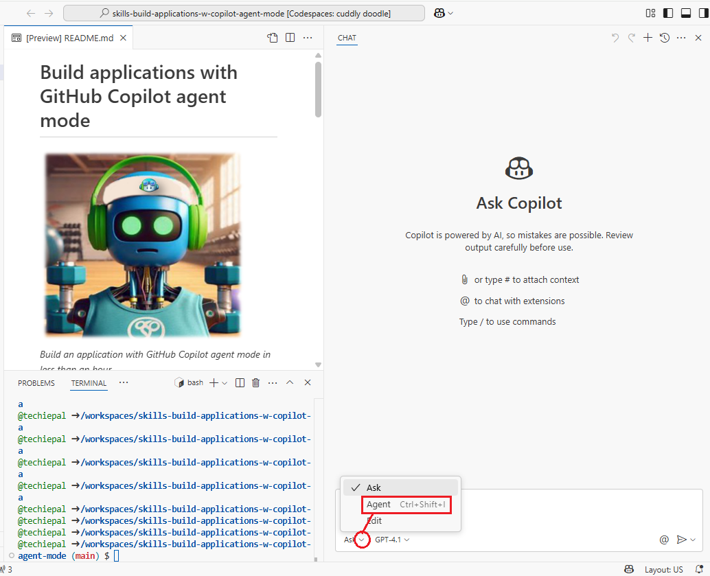
>
> 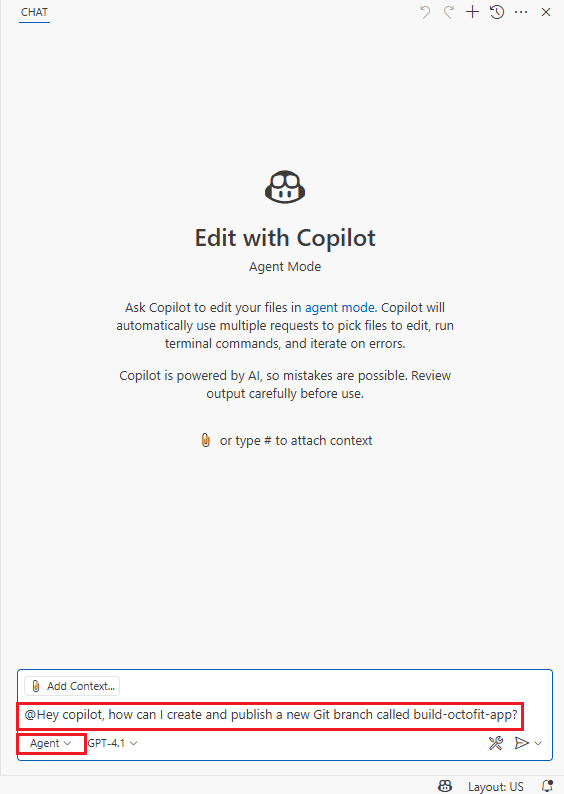
>
>  **Note:**

- Do not change the model from GPT-4o this will be an optional activity
  at the end of the course.

- Keep in mind that the Copilot agent mode is conversational so it may
  ask you questions and you can ask it questions too.

- Wait a moment for the Copilot to respond and press the continue button
  to execute commands presented by Copilot agent mode.

4.  Let's ask Copilot agent mode to help us remember the command and
    create the branch build-octofit-app and publishing it

> Hey copilot, how can I create and publish a new Git branch called
> build-octofit-app?
>
> Copilot agent mode will respond and ask if you want agent mode to run
> the command. Respond with **Yes**.
>
> 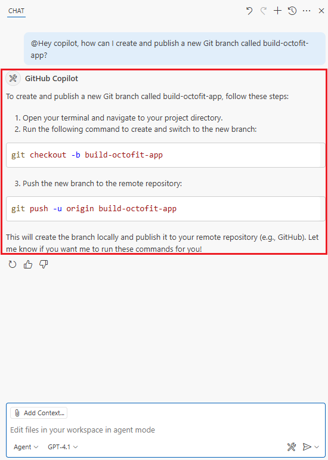

5.  Now that we are happy with the command, press the Continue button to
    let Copilot agent mode run it for you. There is no need to copy and
    paste the command.

6.  Type **Yes** and submit your response.

> 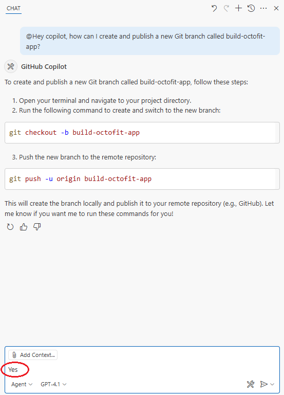
>
> 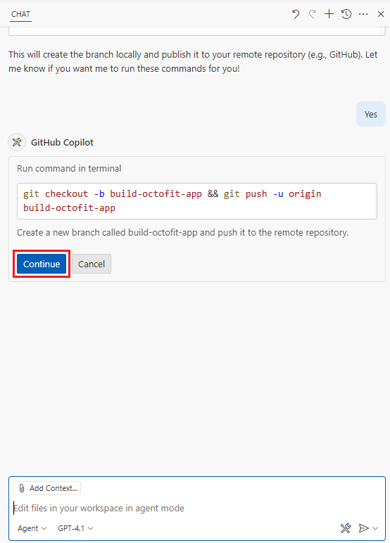

7.  After a moment, look in the VS Code lower status bar, on the left,
    to see the active branch. It should now say build-octofit-app. If
    so, you are all done with this step.

> 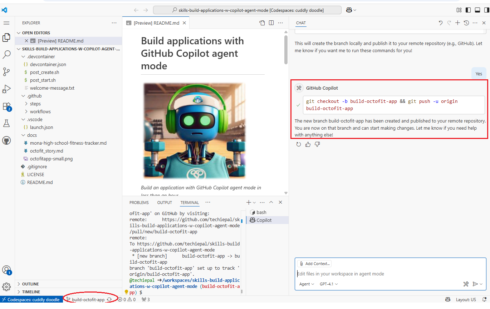

8.  Now that your branch is pushed to GitHub.

> 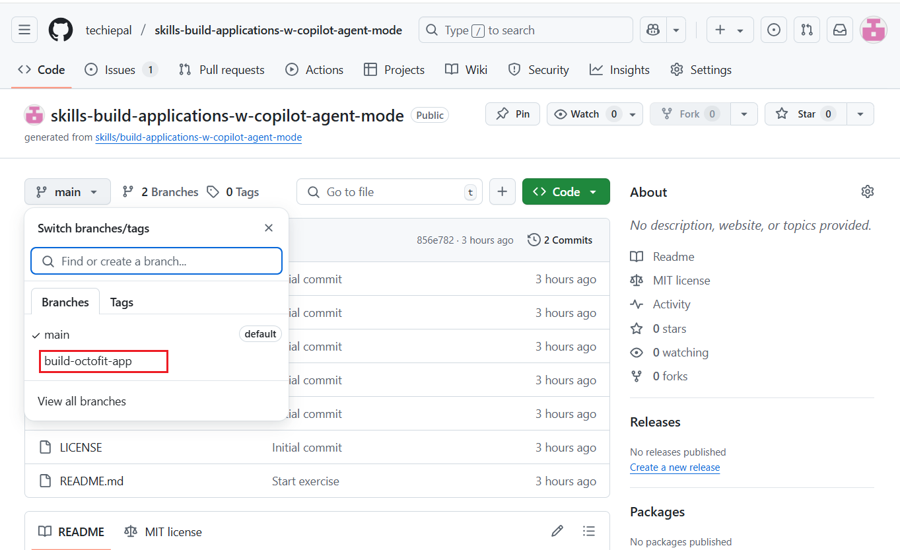

### Exercise \#3: Setup application directory structure, frontend & backend directories, and MongoDB. 

In this exercise, you will:

- Create the octofit-tracker application directory structure.

- Create the octofit-tracker/backend and octofit-tracker/frontend
  directories.

- Create the octofit-tracker/backend/requirements.txt file.

1.  You will use the "Agent" mode in GitHub Copilot Chat instead of
    "Ask" or "Edit" from the drop down and Copy/Paste) the following
    prompt(s).

> 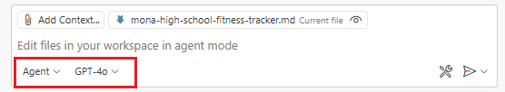
>
> Note:

- Do not change the model from GPT-4o (Premium model) as this will be an
  optional activity at the end of the course. Once the premium model
  consumption limit is reached GitHub Copilot will start using GPT-4.1.

- Keep in mind that the Copilot agent mode is conversational so it may
  ask you questions and vice-versa.

- Wait a moment for the Copilot to respond and press the Continue button
  to execute commands presented by Copilot agent mode.

- Keep files created and updated by Copilot agent mode until it is
  finished.

- Agent mode has the ability to evaluate your code base and execute
  commands and add/refactor/delete parts of your code base and
  automatically self-heal if it or you make(s) a mistake in the process.

2.  Open all files in the docs folder and keep this file open in the
    editor throughout this exercise. Agent mode uses
    **mona-high-school-fitness-tracker.md** and **octofit_story.md** as
    a reference to create the application.

> 

3.  You will now explain to GitHub Copilot the goals and steps using the
    following prompt.

> Let's take the following step by step and generate instructions in
> this order and execute the commands.
>
> Use docs/mona-high-school-fitness-tracker.md as a guide for the
> project structure and requirements.
>
> 1\. Understand the story of creating the fitness application from the
> docs/octofit_story.md file.
>
> 2\. Create the initial directory structure for the octofit-tracker
> application octofit-tracker/backend, octofit-tracker/frontend.
>
> 3\. Setup the backend python virtual environment,
> octofit-tracker/backend/requirements.txt based on
> docs/mona-high-school-fitness-tracker.md, and install required
> packages.
>
> Don't proceed with the next activity until all of these steps are
> completed.
>
> Hit **Submit** after inserting the above prompt.
>
> 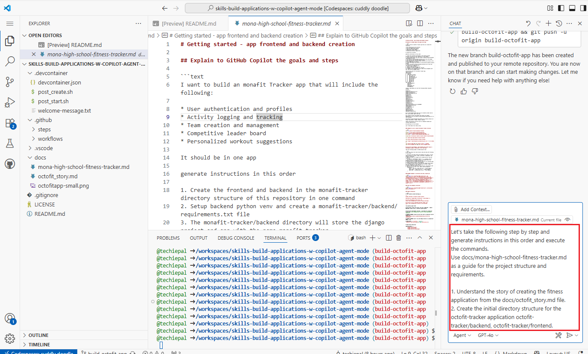

4.  GitHub will now

- Understand the story of creating the fitness application from the
  docs/octofit_story.md file.

- Create the initial directory structure for the octofit-tracker
  application octofit-tracker/backend, octofit-tracker/frontend.

> 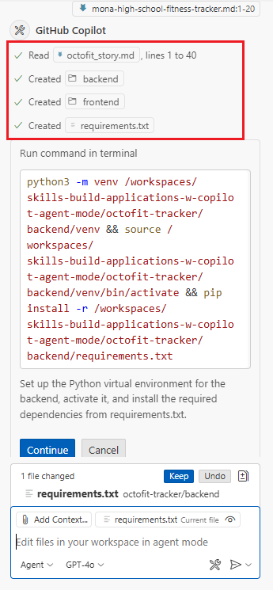

5.  GitHub will now ask your consent to continue setting up the Python
    virtual environment for the backend, activate it, and install the
    required dependencies from requirements.txt.

Click **Continue** button to proceed with the remaining steps.

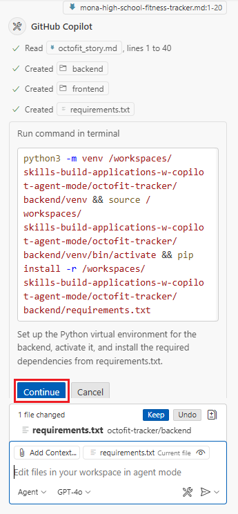

6.  GitHub will follow the instructions and finish setting up the
    directory structure for the OctoFit Tracker application, the backend
    Python virtual environment, and installing the required
    dependencies.

> 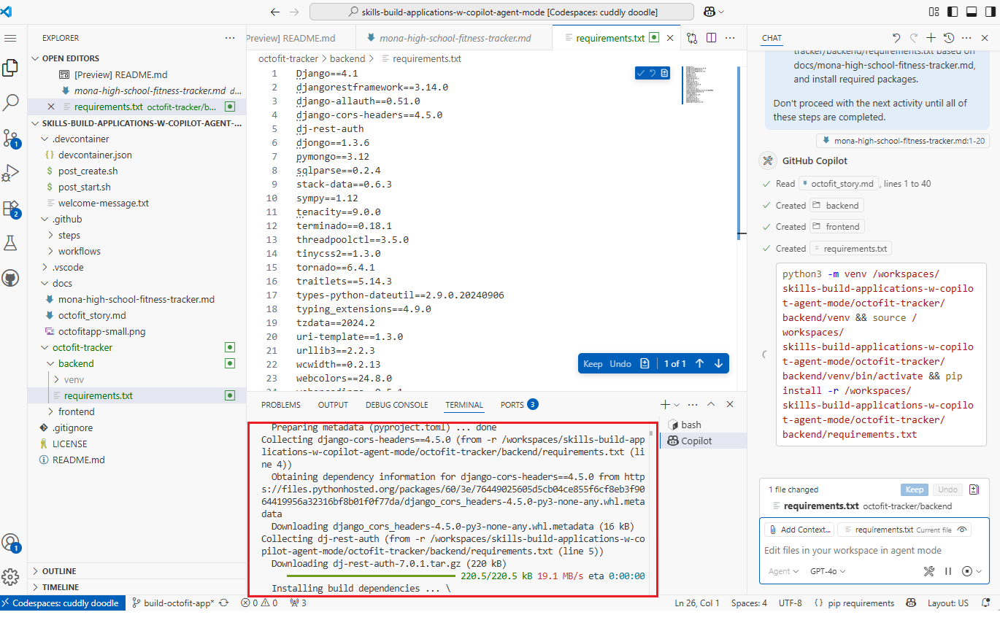
>
> 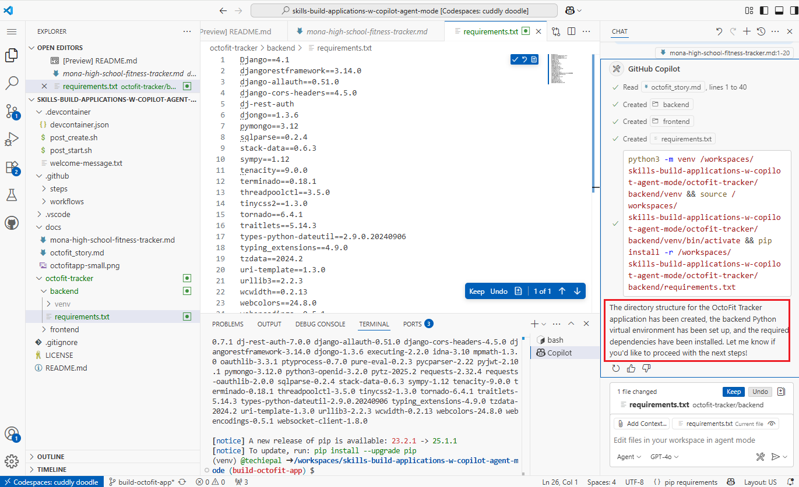
>
> Note: Don't proceed with the next activity until all of these steps
> are completed. Once the above activity installs all the required
> packages, proceed to the next activity.

7.  You will now install MongoDB using GitHub Copilot using the
    following prompt.

> Based on the example monafit tracker app in the
> docs/mona-high-school-fitness-tracker.md file and use octofit as the
> name for mergington's high schools app. \> Let's install MongoDB.
>
> 1\. Install MongoDB and make sure the command is complete.
>
> Don't proceed with the next activity until all of these steps are
> completed.
>
> Hit Submit after inserting the above prompt.
>
> 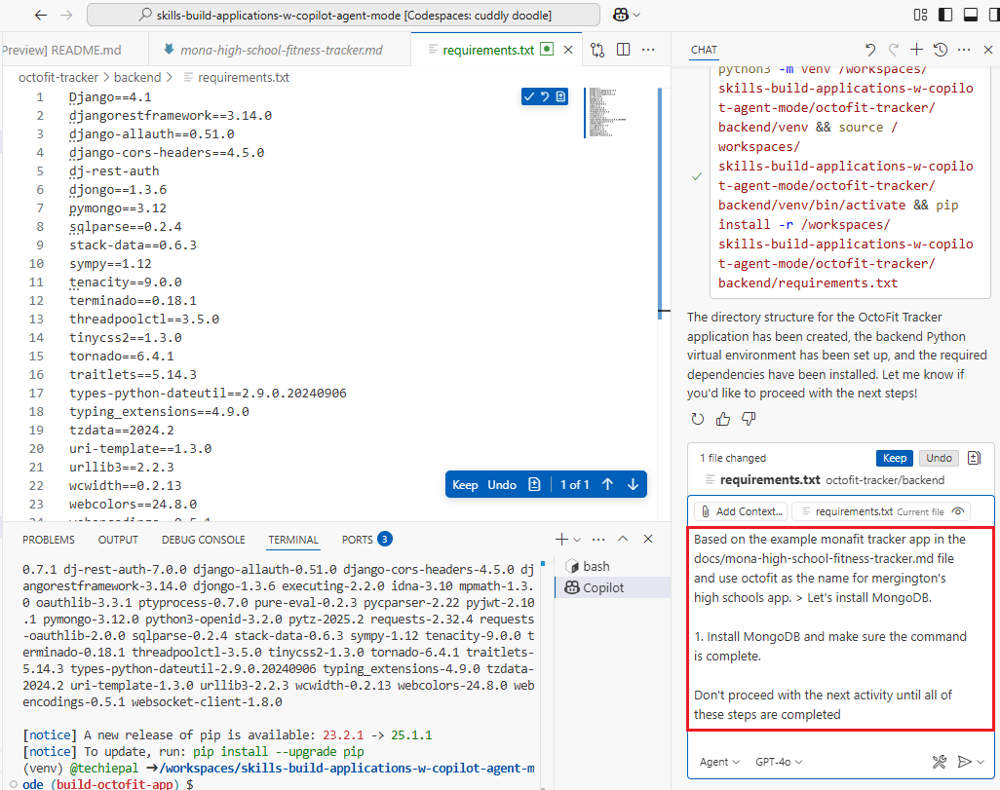
>
> Note**:**

- If the command completes in the terminal but agent mode shows it is
  still running, click stop.

- You may need to paste the prompt again in agent mode.

> 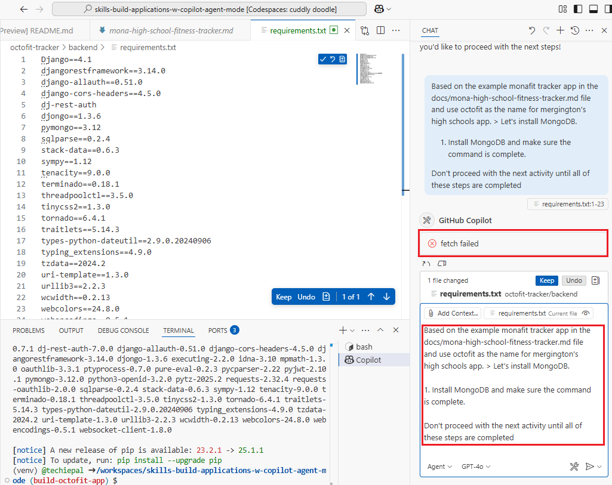

8.  If you have exceeded your premium request allowance, you will be
    automatically switched to GPT-4.1 which is included with your plan. 

> Note: If you want to continue using premium models you need to enable
> additional paid premium requests .
>
> Click **Continue** button to install MongoDB on the system.
>
> 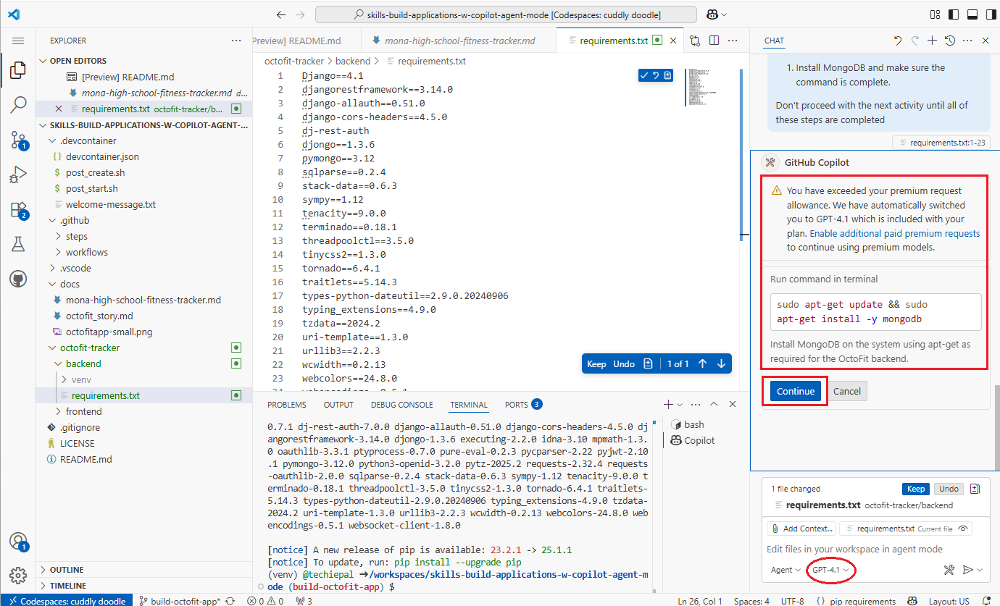

9.  GitHub Copilot Agent completed installing MongoDB.

> 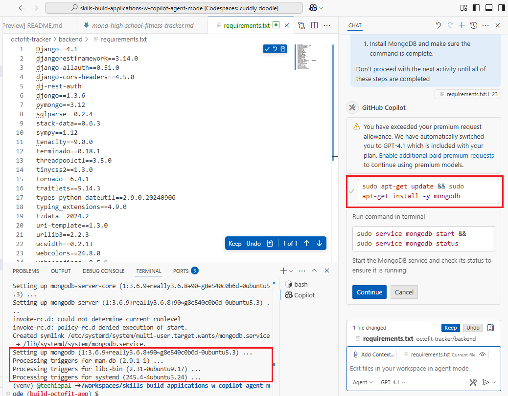

10. Click **Continue** button to start the MongoDB service and check its
    status to ensure it is running.

> 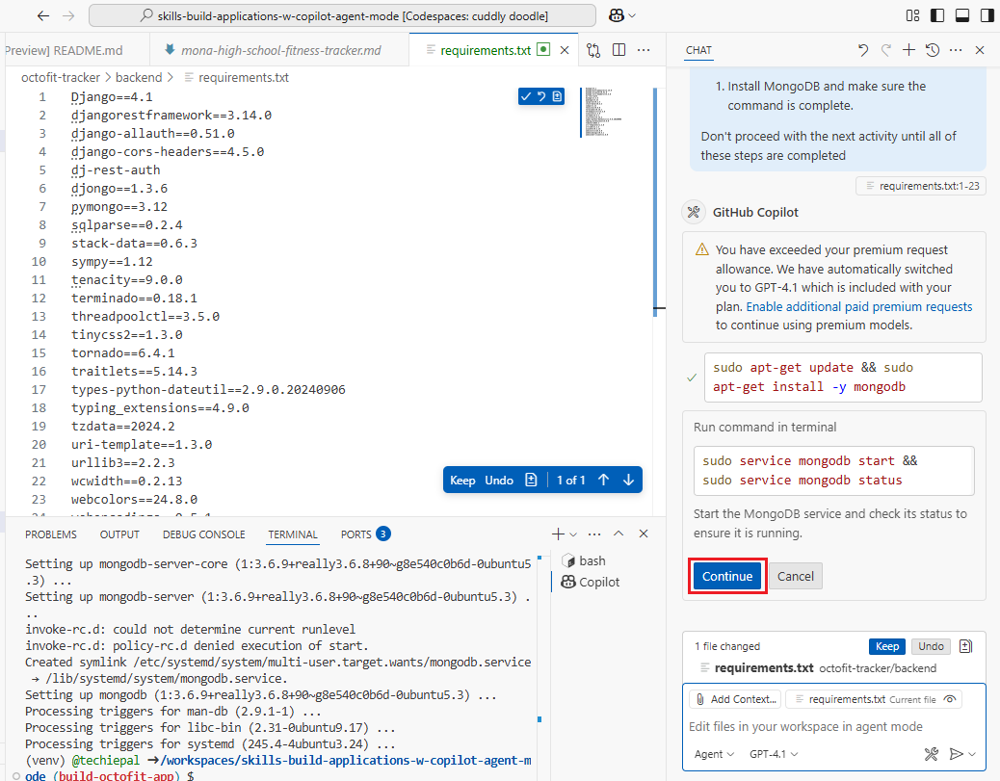
>
> 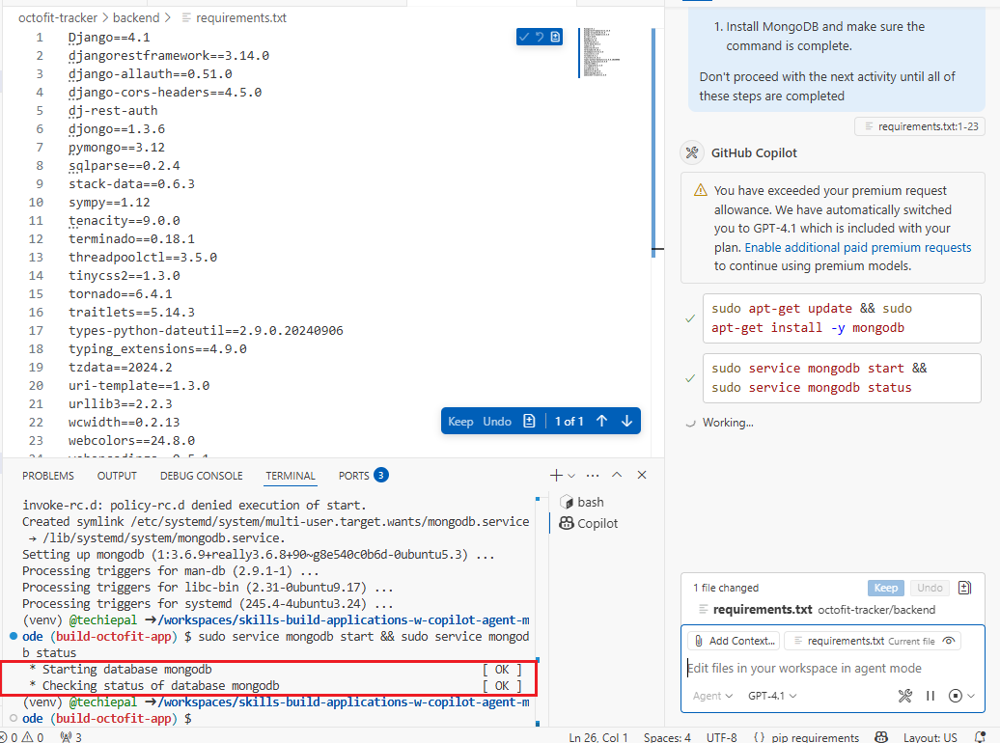

11. GitHub Copilot Agent completed installing MongDB, started and
    checked its status to ensure it is running. 

> 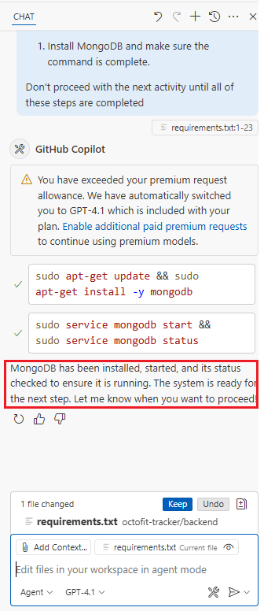

12. Now that you have created the app directory structure, setup a
    Python virtual environment, and Copilot agent mode helped write
    a requirements.txt to install all project dependencies, let's check
    our changes in to our build-octofit-app branch.

13. With the new changes complete, you need
    to **commit** and **push** the changes to GitHub. Enter the
    following prompt and click **Submit** to procced.

> **Help me commit and push the changes to the currently active branch**
>
> 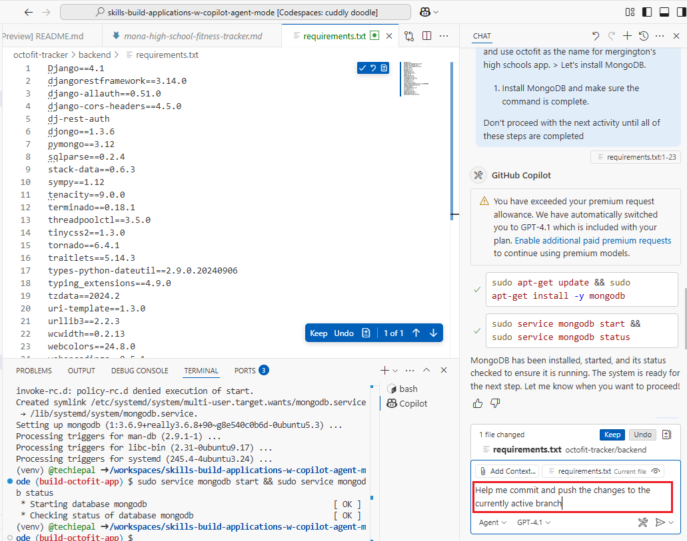
>
> 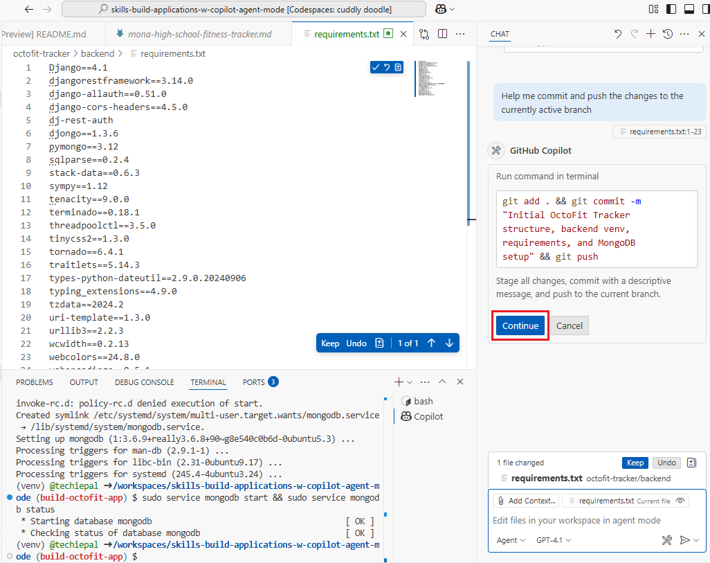
>
> 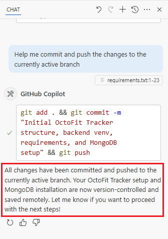
>
> 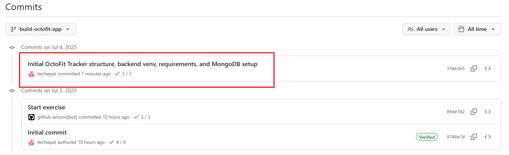

14. Make sure your commit changes were made for the following file to
    the branch build-octofit-app and pushed/synchronized to GitHub:

- octofit-tracker/backend/requirements.txt and it contains the
  package Django==4.1

> 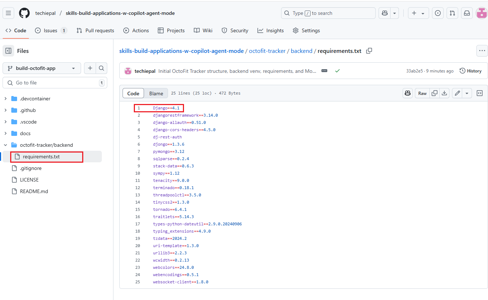

### Exercise \#4: Setup MongoDB, modify App Files, and validate test data. 

In this exercise, you will:

- Set up the octofit_db MongoDB database structure.

- Update the octofit-tracker/backend/octofit_tracker app files:

- settings, models, serializers, URLs, views, tests, and admin files.

- Populate the octofit_db database with test data.

- Verify the test data is populated in the octofit_db database.

1.  You will use the "Agent" mode in GitHub Copilot Chat instead of
    "Ask" or "Edit" from the drop down and Copy/Paste) the following
    prompt(s).

> 
>
> Note:

- Do not change the model from GPT-4o as this will be an optional
  activity at the end of the course.

- Keep in mind that the Copilot agent mode is conversational so it may
  ask you questions and vice-versa.

- Wait a moment for the Copilot to respond and press the Continue button
  to execute commands presented by Copilot agent mode.

- Keep files created and updated by Copilot agent mode until it is
  finished.

- Agent mode has the ability to evaluate your code base and execute
  commands and add/refactor/delete parts of your code base and
  automatically self-heal if it or you make(s) a mistake in the process.

2.  Open all files in the docs folder and keep this file open in the
    editor throughout this exercise. Agent mode uses
    **mona-high-school-fitness-tracker.md** and **octofit_story.md** as
    a reference to create the application.

> 

3.  You will now explain to GitHub Copilot the goals and steps using the
    following prompt.

> Let's take the following step by step and generate instructions in
> this order and execute the commands.
>
> Use docs/mona-high-school-fitness-tracker.md as a guide for the
> project structure and requirements.
>
> 1\. Understand the story of creating the fitness application from the
> docs/octofit_story.md file.
>
> 2\. Create the initial directory structure for the octofit-tracker
> application octofit-tracker/backend, octofit-tracker/frontend.
>
> 3\. Setup the backend python virtual environment,
> octofit-tracker/backend/requirements.txt based on
> docs/mona-high-school-fitness-tracker.md, and install required
> packages.
>
> Don't proceed with the next activity until all of these steps are
> completed.
>
> Hit **Submit** after inserting the above prompt.
>
> 

4.  GitHub will now

- Understand the story of creating the fitness application from the
  docs/octofit_story.md file.

- Create the initial directory structure for the octofit-tracker
  application octofit-tracker/backend, octofit-tracker/frontend.

Summary:

In this lab, you have

- Initialized a new Git repository to start tracking your projects.

- Understood the process of creating branches to manage different
  features or versions of your code.
