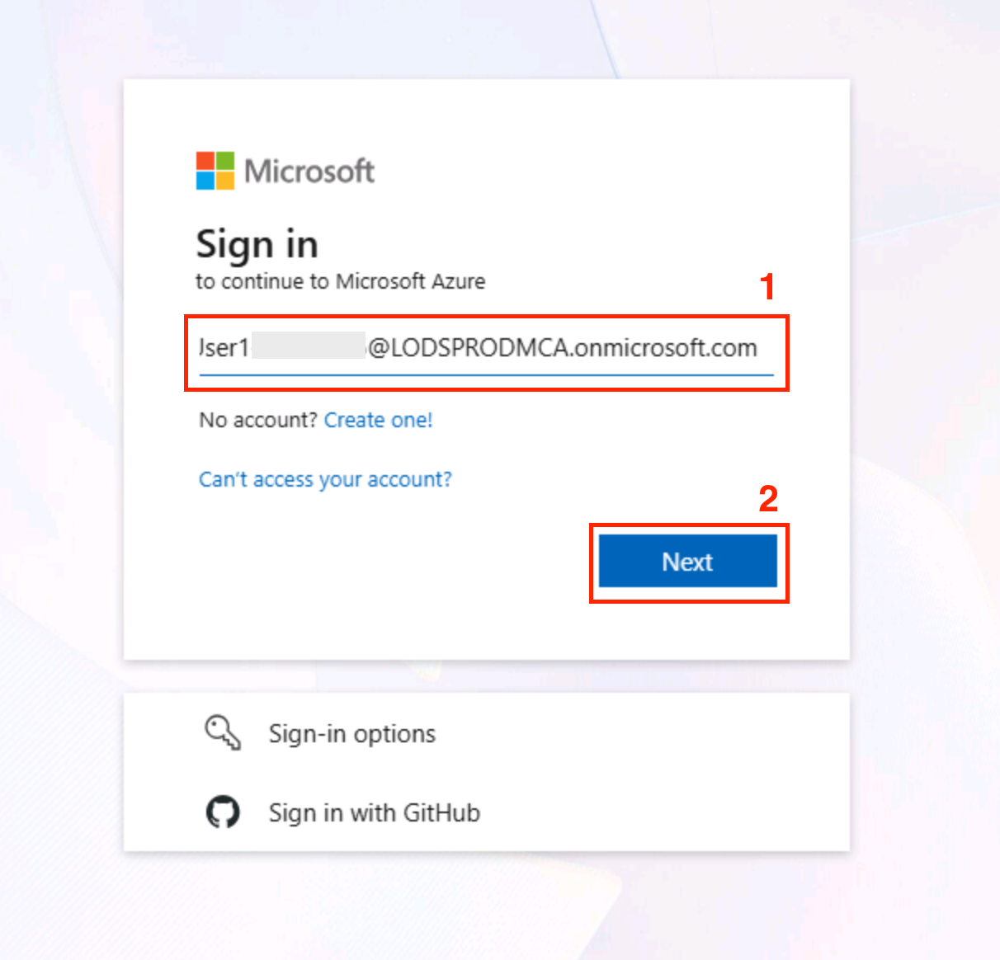

# Lab 2 - Migrate database from an on-premises SQL Server to Azure SQL Database

## Introduction

Modernizing on-premises databases by migrating them to the cloud is a
critical step in adopting Azure's fully managed platform and improving
scalability, security, and maintainability. In this lab, you will
perform an end-to-end migration of a SQL Server database hosted on a
Windows Virtual Machine to **Azure SQL Database**.

## Objective

The objective of this lab is to guide the learners through the
end-to-end process of migrating a SQL Server database hosted on a
Windows Virtual Machine to Azure SQL Database. By completing this lab,
participants will gain hands-on experience in provisioning a SQL Server
VM, preparing the AdventureWorks sample database, configuring the Azure
Database Migration Service (DMS), and executing an offline migration to
Azure SQL Database. This exercise demonstrates how to modernize
on-premises SQL workloads by leveraging Azure’s fully managed database
platform.

## Exercise 1 - Create an On prem SQL Server

Companies have legacy databases which they would need to migrate to
Azure to modernize their applications. We need an On-prem database which
we can migrate to the Azure SQL Database. In this Exercise, you will
create an On-prem Database in Azure SQL Virtual Machine.

1.  Sign in to the **Azure portal** at +++https://portal.azure.com+++
    using the following cloud slice credentials.

    - Username - +++@lab.CloudPortalCredential(User1).Username+++

    - Password - +++@lab.CloudPortalCredential(User1).Password+++
 
    
    
    

2.  Search for and select +++**Azure SQL**+++.

    

3.  In the Overview page, find **SQL Server on Azure Virtual Machines**
    and select **Show options**.

    

4.  Choose **Free SQL Server License: SQL Server 2019 Developer on
    Windows Server 2022** image from the list.

    

    

5.  Select **Create virtual machine** to start creating the VM.

    

6.  In the Create a virtual machine, select **ResourceGroup1** from the
    **Resource group** dropdown.
    

7.  Enter the below details under the Instance details

    - Virtual Machine Name – +++**SQLVM**+++

    - Region – **@lab.CloudResourceGroup(ResourceGroup1).Location** is selected here

    - Availability options – Select **No infrastructure redundancy
    required**

    - Security type – Standard

    - Image – Select **Free SQL Server License: SQL Server 2019 Developer on
    Windows Server 2022**

    - Size – **Standard_D16ds_v4-16 vcpus, 64 GiB memory**

    

8.  Under Administrator account, enter the below details and select
    **Next:Disks**.

    - User name – Enter +++sqlserveradmin+++

    - Password – Enter +++sqlPwd981!2@98+++

    

9.  Accept the defaults in other pages till the **SQL Server Settings**
    page. In the **SQL Server Settings** page,

    - SQL Authentication – **Enable**

    - Login – Enter +++**sqlserveradmin**+++

    - Passwrod – Enter +++**sqlPwd981!2@98**+++

    

10. Select **Review + Create** to create the VM.

    

11. Click on **Create** once the validation succeeds.

    

12. Once the deployment is complete, select **Go to resource**. The
    deployment will take around 20 minutes to complete.

    

13. From the **Overview** page of the VM, look for the **Public IP** and
    **save** the **IP value** in a notepad. This value will be needed to
    **connect** to the **database** in the VM.

    

14. From the left pane of the VM, select **Network Settings** under
    **Networking**. Select **+ Create port rule** -\> **Inbound port rule**.

    

15. We will need to add an inbound port rule to allow TCP traffic from
    port 1433.

16. In the Add inbound security rule pane, select the below values and
    then select **Add**.

    - Source – Select **Any**

    - Source port ranges - \*

    - Destination – Select **Any**

    - Service – Select **Custom**

    - Destination port ranges – Enter +++**1433**+++

    - Protocol – Select **TCP**

    - Action – Select **Allow**

    - Name – Enter +++TCPRule+++

    

    

17. From the VM’s Overview page, select the drop down next to
    **Connect** and select the **Connect** option.

    

18. In the **SQLVM|Connect** page, select the **Download RDP file**
    option to download the Remote Desktop Connection file.

    

    **Note:** If you get a pop-up, select **Keep**.

19. Double click the downloaded file to connect to the VM. Select
    **Connect** when prompted.

    

20. Login using the VM credentials.

    - Username - +++sqlserveradmin+++

    - Password - +++sqlPwd981!2@98+++

    
21. Select **Yes**
    

22. Once logged in, open web browser and select **Start without your data**.
    
    
23. Click **Confrim and Continue**.
    
    
24. Click **Continue without Google Data**.
    
    
25. Click **Confirm and start browsing**.
    
    
27. Open the link +++https://download-directory.github.io/+++.
    
    
29. Enter +++https://github.com/Labsrepo/Labfiles+++ and press **Enter**.
    
    
31. Open the folder where the file is downloaded and unzip the downloaded folder, and then unzip the adventureworks zip file from it.
    
    
    
    This will be used as the input data in this exercise.
    
33. Create a folder named **Labfiles** in C drive and paste adventureworks2019.bak file in it.
    
    
35. Open the +++SQL Server Management Studio 20+++ from
    the windows Start menu.
    

36. Ensure that the below details are selected, update if the values are
    different.

    - Server name - +++SQLVM+++

    - Authentication Type - Windows Authentication

    - Encryption – Optional

    - Trust Server certificate – Select the checkbox.
    Then  click on **Connect**

    

37. The connection succeeds and gets connected to the SQL Server.

    

38. Right click on the Databases – Select **Restore Database**.

    

39. In the Restore Database page, select **Device** -\> select the
    **three dots** to navigate to the File Explorer in order to upload
    the database.

    

40. Click on **Add**.

    

41. There is a .bak file of the **Adventureworks** database under
    **C:\LabFiles**. Navigate to the path and select
    **AdventureWorks2019.bak** and select **OK**. Select **OK** once the
    file is uploaded.

    

42. Click **OK**.

    

43. In the Restore pane, ensure that the uploaded .bak file is selected
    and then click on **OK**.

    

44. Once the upload is **successful**, you will get a success message
    that the upload is completed.

    

45. Now, you have an On-prem SQL Server with the Database Adventure
    Works inside it.

    

The aim is to migrate this DB to the Azure SQL Database. Now minimise
the VM.

## Exercise 2 - Create an Azure SQL Database

In this exercise, you will create an Azure SQL Database to which you
will migrate your on-prem database.

1.  Close the VM and in a new window open the Select SQL Deployment
    option page at +++https://portal.azure.com/#create/Microsoft.AzureSQL+++ and
    select **Show options**.

    

2.  Select the **Create SQL Database** option.

    

3.  In the **Create SQL Database** page, click on **Create New** under
    Resource group – Type in the **Name** as +++**RG4TargetDB**+++.
    Select **OK**.

    

4.  Enter the **Database name** as +++**adventwkdb**+++ and select
    **Create new** under **Server**.

    

5.  Enter the below details and click **OK**.

    - Server name - +++mysqlserver789698+++

    - Location – East US2

    - Authentication method – Use SQL authentication

    - Server admin login - +++tgsqlserveradmin+++

    - Password - +++sqlPwd981!2@98+++

    

    

6.  Back in the Create SQL Database page, update the below details and
    select **Next: Networking.**

    - Want to use elastic pool – Select **No**

    - Workload environment – Select **Devlopment**

    - Backup storage redundancy – Select **Locally-redundant backup
      storage**

    

    

7.  In the Networking page, select the below options and select **Next :
    Security**.

    - Connectivity method – Select **Public endpoint**

    - Add current client IP address – **Yes**

    - Connection policy – Select the **Default** option

    

8.  Accept the defaults in the **Security** page and then click on
    **Next : Additional Settings**. Accept the defaults in the other
    pages and navigate to the **Review + create** page and click on
    **Review + create**.

    

    

    

9.  Once the validation completes, select **Create** to create the
    resource.

    

    

10. Once the deployment succeeds, select **Go to resource**.

    

    

11. From the overview page, copy the value of the **Server name** and
    save it in a notepad for usage in future exercise.

    

## Exercise 3 – Create Data Migration Service

In this exercise, you will create a Data Migration Service using which
you will be migrating the database.

1.  From the database page, select **Query editor** from the left pane.

    

2.  Login using

    - Login - +++**tgsqlserveradmin**+++

    - Password - +++**sqlPwd981!2@98**+++

    

3.  To create the login and user on the target Azure SQL Database, run
    the following script
    ```
    CREATE USER \[migrationuser\] WITH PASSWORD = 'sqlPwd981!2@98'; ALTER
    ROLE db_owner ADD MEMBER \[migrationuser\];
    ```

    

    **Note:** If you get a pop-up stating “Your unsaved edits will be
    discarded”. Then click **OK**.

4.  Navigate to the Home page of the Azure portal. From the search bar,
    search for and select +++**Azure Database Migration Service+++**

    

5.  Select the **Start a new migration** option.

    

6.  Enter the below details and select **Select**.

    - Source server type – Select **SQL Server**

    - Target server type – Select **Azure SQL Database**

    - Database Migration Service – Select **Database Migration Service**

    

7.  In the **Create Data Migration Service** page, enter the below
    details and select **Review + create**.

    - Subscription – Select your assigned **subscription**
    - Resource group – Select **RG4TargetDB**
    - Location – **East US 2** is used here.
    - Migration Service Name – Enter +++**dbMigrate**+++

    

8.  Once the validation passes, select **Create**.

    

9.  Click on **Go to resource** to go to the created Migration Service
    resource.

    

10. A self-hosted integration runtime is required to access your source
    database backups, check the validity of the backup set, and upload
    backups to Azure storage account.

11. In the **dbMigrate** resource that you just created, select the
    **View Integration runtime** option.

    

12. Select Configure integration runtime option.

    

13. Select the **Download and install the integration runtime** option
    and click on Download in the browser that opens.

    

    

14. Select the first option and click on **Download**.

    

15. Double click on the downloaded file and follow the prompts to
    complete the installation.

    

    

    

    

16. Once the installation is complete, the **Integration Runtime** asks
    for a **Authentication Key**. Copy the same from the Azure portal as
    in the screenshot below and paste it in the **Integration Runtime
    Configuration Manager** and click on **Register**.

    

    

17. Once the registration is successful, **Finish** the Configuration
    Manager.

    
18. Click **Close**.
    

19. Once this is done, after few minutes, the status of the Integration
    runtime will change to **Online**. Proceed to the next step once it
    is **Online**.

    

## Exercise 4 - Migrate SQL Server to Azure SQL Database (offline)

In this exercise, you will perform the most important part – **The
Migration**. You will use the Database Migration System (DMS) in Azure
to perform the same.

1.  From the dbMigrate Overview page, select **New Migration**.

    

2.  In the **Select new migration scenario**, select the below details
    and select **Select**.

    - Source server type – Select **SQL Server**

    - Target server type – Select **Azure SQL Database**

    

3.  In the **Azure SQL Database Offline Migration Wizard**, enter the
    below details and select **Next: Connect to source SQL Server**

    - Source Infrastructure Type – Select **Virtual Machine**

    - Resource group – Select **ResourceGroup1**

    - Location – **@lab.CloudResourceGroup(ResourceGroup1).Location** is used here

    - SQL Server Instance Name – Give the **VM’s IP address** (This will be
    a unique value)

    

4.  In the next screen, enter the below details and then select **Next:
    Select Databases for migration**.

    - Source server name – Enter the VM IP address

    - Authentication type – Select **SQL Authentication**

    - User name – Enter +++sqlserveradmin+++

    - Password – Enter +++sqlPwd981!2@98+++

    

    

5.  Next, select **AdventureWorks2019** database and select Next:
    Connect to targe Azure SQL Database.

    

6.  In the next screen, the details of the target DB are populated.
    Check these, enter the password as +++sqlPwd981!2@98+++ and select
    **Next: Map source and target databases**.

    

7.  Select the Target database as +++**adventwkdb**+++ and select
    **Next: Select Database tables to migrate**

    

8.  In the next page, you can select either one of the tables for
    testing, or select all the tables and then select **Next: Database
    migration summary**. Check the details and select the **Start
    migration** option.

    

    

    

    

    The migration takes around 30 minutes to complete. Once the migration is
    complete, the status changes to **Succeeded**.

    

## Exercise 5 - Check the migrated Database

Now that the migration is complete, you should check the database that
is migrated to Azure. We will use the **SQL Server Management Studio**
to do the same.

1.  Open the **SSMS** from your system (not the Azure VM).

    

2.  Select **Connect** -\> **Database Engine**. Fill in the details as
    below and then select **Connect**.

    - Server Name – Ente the **Server name** that you saved after creating
    the Azure SQL Database

    - Administration – Select **SQL Server Authentication**

    - User Name – Enter +++**tgsqlserveradmin**+++

    - Password – Enter +++**sqlPwd981!2@98**+++

    - Encrypt – Select **Optional** and check mark **Trust Server
    Certification**.

    

3.  Once connected, check the databases.

    

4.  You will find the migrate Adventureworks Database that got migrated
    from the SQL Server.

    

## Summary

In this lab, you created a SQL Server VM in Azure, deployed the
AdventureWorks database, and prepared it for migration. You then set up
and used the Azure Database Migration Service (DMS) to perform an
offline migration of the database from the SQL Server VM to Azure SQL
Database. Through this process, you learned the key steps involved in
assessing readiness, configuring source and target environments, and
executing a secure and reliable migration. This hands-on exercise
highlighted best practices for migrating SQL Server workloads to Azure
SQL Database, enabling a smoother transition to a fully managed cloud
environment.
