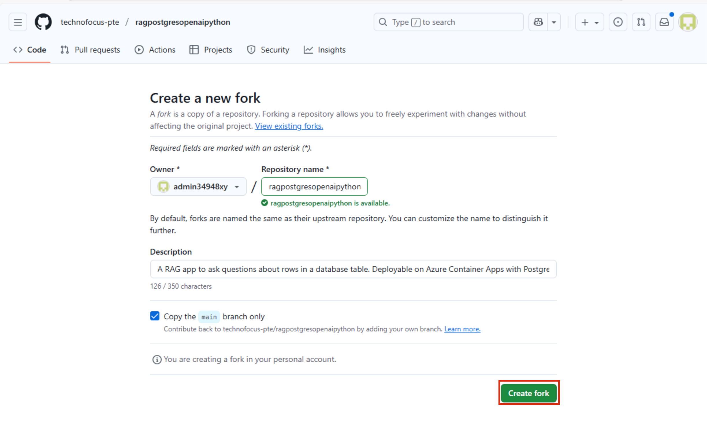
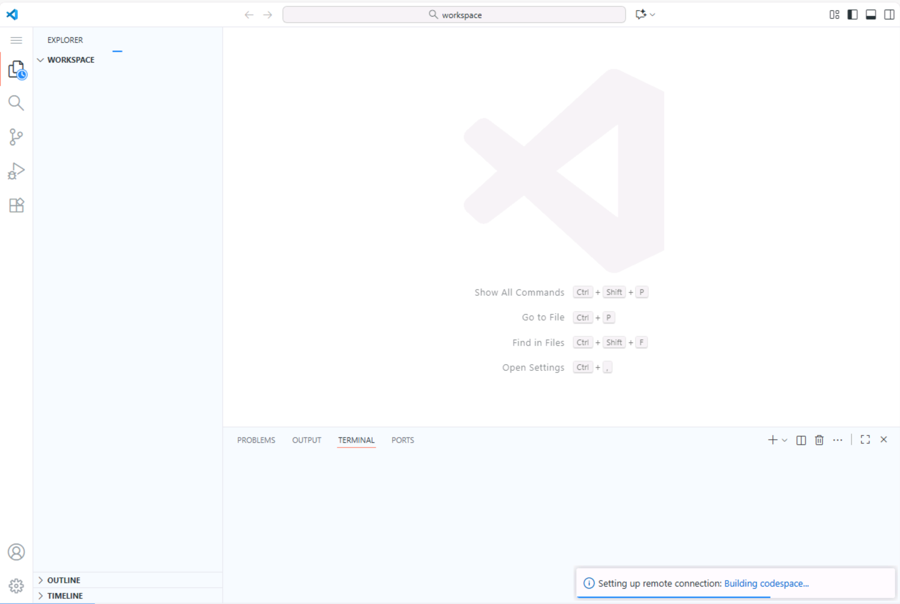
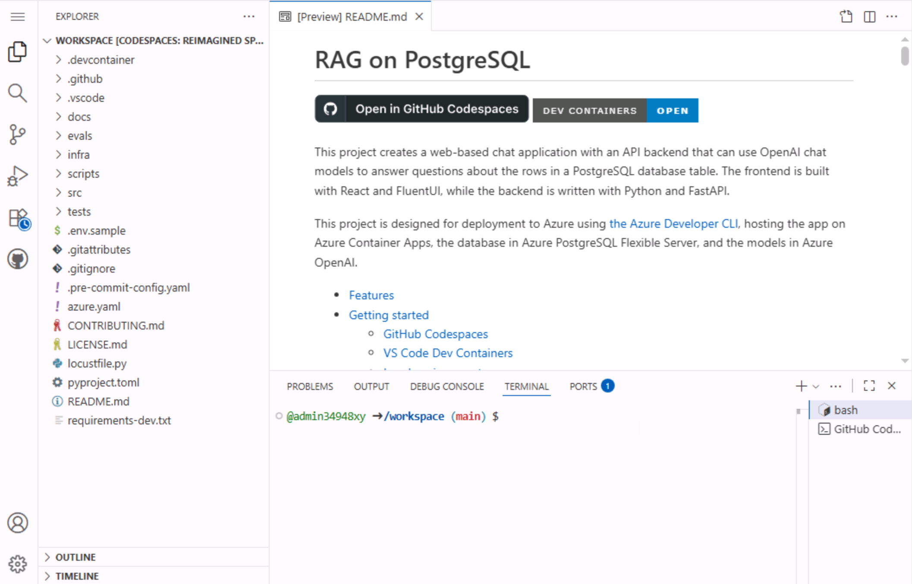
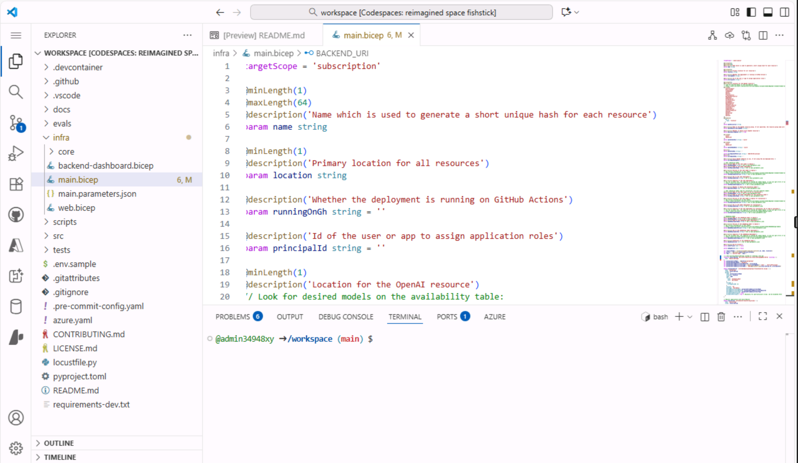

# Lab 08 - Deploying chat app on Azure Container Apps with PostgreSQL Flexible Server
 
**Objective:**

In this lab, you create a web-based chat application with an API backend that can use OpenAI chat models to answer questions about the rows in a PostgreSQL database table. The frontend is built with React and FluentUI, while the backend is written with Python and FastAPI. It is designed for deployment to Azure using the Azure Developer CLI, hosting the app on Azure Container Apps, the database in Azure PostgreSQL Flexible Server, and the models in Azure OpenAI.

This project provides the following features: 
- Hybrid search on the PostgreSQL database table, using the pgvector extension for the vector search plus full text search, combining the results using RRF (Reciprocal Rank Fusion).

- OpenAI function calling to optionally convert user queries into query filter conditions, such as turning "Climbing gear cheaper than $30?" into "WHERE price < 30". 

- Conversion of user queries into vectors using the OpenAI embedding API. 

  

**Key technologies used** -- Python, FastAPI, Azure OpenAI models, Azure
Database for PostgreSQL and azure-container-apps,ai-azd-templates.

**Estimated duration** -- 45 minutes

**Pre-requisites:**

GitHub account -- You are expected to have your own GitHub login
credentials. If you do not have, please create one from here
+++https://github.com/signup?user_email=&source=form-home-signupobjectives+++

## Exercise 1 : Provision, deploy the application and test it from the browser
###  Task 1 : Register Service provider

1.  Open a browser go to +++https://portal.azure.com+++ and sign in with
    your cloud slice account below.
    - Username - +++@lab.CloudPortalCredential(User1).Username+++
    - TAP Token - +++@lab.CloudPortalCredential(User1).AccessToken+++
      
   
   

2.  Click on **Subscriptions** tile.

    

3.  Click on the subscription name.

     

4.  Expand Settings from the left navigation menu. Click on **Resource
    providers**, enter +++**Microsoft.AlertsManagement+++** and select
    it, and then click **Register**.

     
     

5.  Click on **Resource providers**,
    enter +++**Microsoft.DBforPostgreSQL+++** and select it, and then
    click **Register**.
      
      
      
      

7.  Similarly register the following Resource providers:
    - **+++Microsoft.Search+++**
    - **+++Microsoft.Web+++**
    - **+++Microsoft.ManagedIdentity+++**
    - **+++Microsoft.Management+++**
    - **+++Microsoft.operationalinsights+++**

### Task 2: Copy the existing resource group name

1.  On Home page, click on **Resource groups**  tile.
      

2.  Make sure you already have a resource group created for you to work.
    Never delete this resource group. Instead, you can delete resources
    within the resource group, but not the resource group itself.

3.  Click on resource group name.
      

4.  Copy the resource group name and save it in Notepad to use for
    deploying all resources into this resource group.

     

### Task 3 : Open development environment

1.  Open your browser, navigate to the address bar, type or paste the
    following
    URL: +++https://github.com/technofocus-pte/ragpostgresopenaipython.git+++ and sign-in using your GitHub credentials.
    

2.  Click on **fork** to fork the repo. Give unique name to the repo and
    click on **Create repo** button.
      
      

3.  Click on **Code -> Codespaces -> Codespaces+**
    

4.  Wait for the Codespaces environment to setup .It takes few minutes
    to setup completely
    
    

### Task 4: Provision Services and deploy application to Azure

1.  In the **infra** folder, select the **main.bicep** file to open it.
    
2.  Navigate to the **C:\LabFiles\Deploying chat app on Azure Container Apps with PostgreSQL Flexible Server** directory, select the **main.bicep** file, and open it.
3.  Copy the code and replace the contents of the main.bicep file in the Codespace. 
    
4.  The file will save automaticaly in the codesapce.
5.  Run the following command on the Terminal. It generates the code to
    copy. Copy the code and press Enter.

      +++azd auth login+++

      

6.  Default browser opens to enter the generated code to verify. Enter
    the code and click **Next**.

      

7.  Sign in with your Azure credentials.

      

8.  To create an environment for Azure resources, run the following
    Azure Developer CLI command.It asks you to enter environment name
    .Enter any name of your choice and press enter (eg :+++ragpgpy@lab.LabInstance.Id+++)

    **Note:** When creating an environment, ensure that the name consists of
    lowercase letters.

      +++azd env new+++

      
9. Run below command to set resource group

   +++azd env set AZURE_RESOURCE_GROUP ResourceGroup1+++
     

10.  Run the following Azure Developer CLI command to provision the Azure
    resources and deploy the code.

      +++azd up+++

    
11.  When prompted, select a **subscription** to create the resources and
    select the region closest to your location; in this lab, we have
    chosen the **@lab.CloudResourceGroup(ResourceGroup1).Location** region.

      

12.  When prompted, **enter a value for the 'openAILocation'
    infrastructure parameter** select the region closest to your
    location; in this lab, we have chosen the **North Central
    US** region

      

13.  Provisioning resource will take around 15-16 min. Click **Yes** if
    prompted.

       

14. Wait for the template to provision all resource successfully.

     

   
15. Wait for the deployment to complete. Deployment takes 5 mins

      

16. Click on the deployed web app endpoint link.

     

17. Click on **Open**. It opens new tab with app

     

18. The app opens.

      

    >[!Alert] Important: If you face any issue launching the app, please redeploy it by following step 12, i.e azd deploy

### Task 5: Use chat app to get answers from files

1.  In the **RAG on database |OpenAI+PoastgreSQL** web app page, **click
    on Best shoe for hiking?** button and observe the output

    

     

2.  Click on the **clear chat.**

     

3.  In the **RAG on database |OpenAI+PoastgreSQL** web app page, click
    on **Climbing gear cheaper than \\$30** button and observe the
    output

      

      

4.  Click on the **clear chat.**

### Task 6: Verify deployed resources in the Azure portal

1.  On Home page of Azure portal, click on **Resource Groups**.

      

2.  Click on your resource group name

      

3.  Make sure the below resource got deployed successfully

    - Container App

    - Application Insights

    - Container Apps Environment

    - Log Analytics workspace

    - Azure OpenAI

    - Azure Database for PostgreSQL flexible server

    - Container registry

    

4.  Click on **Azure OpenAI** resource name.

    

5.  On **Overview** in the left navigation menu, click **Go to Azure AI
    Foundry portal** and select to open a new tab.

      

6.  Click on **Shared resources -\>** **Deployments** from left
    navigation menu and make
    sure **gpt-35-turbo**, **text-embedding-ada-002** should be deployed
    successfully

    

### Task 7 : Clean up all the resources

To clean up all the resources created by this sample:

1.  Switch back to **Azure portal -\> Resource group- \> Resource group
    name.**

     

2.  Select all the resource and then click on Delete as shown in below
    image. (**DO NOT DELETE** resource group)

     

3.  Type ``delete`` on the text box and then click on **Delete**.

     

4.  Confirm the deletion by clicking on **Delete**.

      

5.  Switch back to Github portal tab and refresh the page.

      

6.  Click on Code , select the branch created for this lab and click on
    **Delete**.

      

7.  Confirm the branch deletion by clicking on **Delete** button.

      

## Summary
This use case walks you through deploying a chat application with PostgreSQL and OpenAI on Azure, focusing on cloud-based application
deployment and management. you’ve set up the development environment,
installed necessary tools like Azure CLI, configured Azure resources
using Azure Developer CLI, and deployed the application to Azure
Container Apps.
